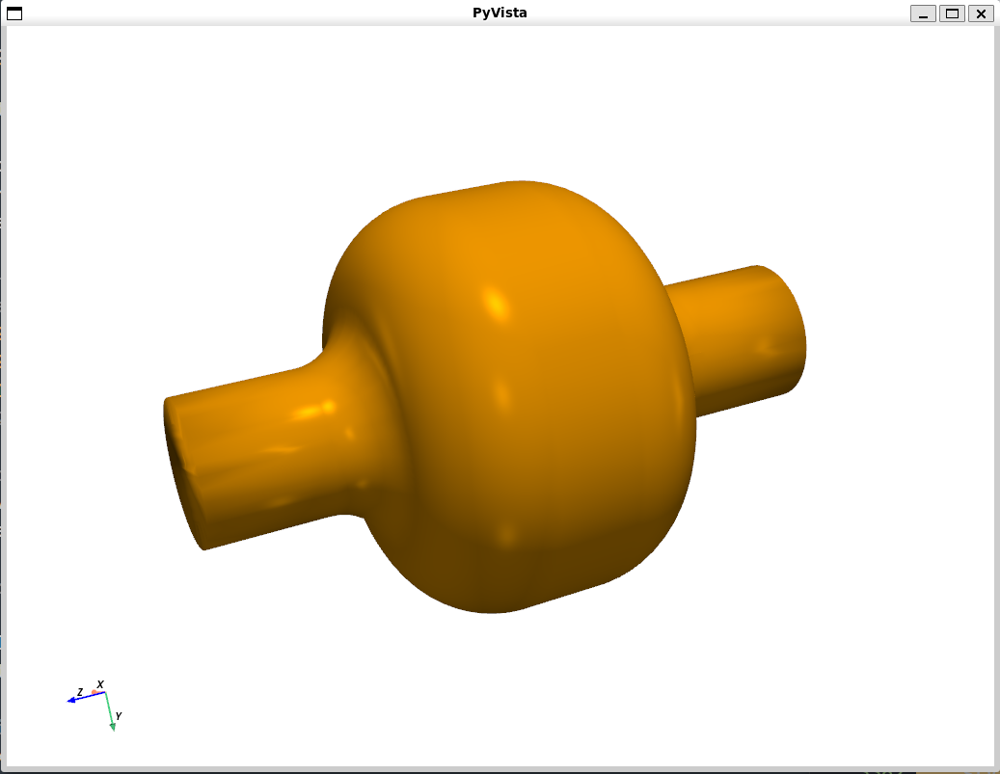

# User's Guide

This section aims to showcase `wakis`capabilities together with useful recipes to use in the simulation scripts.

Since `wakis` has been developed for computing bea, coupling impedance for particle accelerator components, the example that will serve as a conductive thread for the explanation is a **pillbox cavity with a passing proton beam**. 

The guide will go into detailed step-by-step on how to write the simulation script and visualize or access the computed data.

## Import modules

The first part of a python script always includes importing external sources of code e.g., `packages` or `modules`. In `wakis`, we use:

* `numpy`: Used for numerical operations, especially for matrix operations.
* `scipy.constants`: to import physical constants easily like vacuum permittivity `eps_0` or the speed of light `c`
* `matplotlib`: Used for 1d and 2d plotting and visualization.
* `h5py`: To store data in the memory-efficient format HDF5
* `tqdm`: This package is used for displaying progress bars in loops.
* `pyvista`: For handling and visualizing 3D CAD geometries and vtk-based 3D plotting.

Optionally, one can use `os` or `sys` packages to handle the PATH and directory creations. The first part of any simulaiton script could look similar to:

```python
import numpy as np
import matplotlib.pyplot as plt
import os, sys
import pyvista as pv
import h5py
from tqdm import tqdm
from scipy.constants import c as c_light
```

Next step is to import the `wakis` classes that will allow to run the electromagnetic simulations:

```python
from gridFIT3D import GridFIT3D        # Grid generation
from solverFIT3D import SolverFIT3D    # EM field simulation
from wakeSolver import WakeSolver      # Wake and Impedance calculation
```

## Simulation domain, geometry and materials setup

`wakis` is a numerical electromagnetic solver that uses the Finite Integration Technique. The grid used is a structured grid composed by rectangular cells. The simulation domain is a rectangular box that will be broken into cells where the electromagnetic fields will be computed.

### Number of mesh cells

 In every `wakis` simulation example, the script starts specifiyng the number of mesh cells per direction the user wants to use:

```python
# ---------- Domain setup ---------
# Number of mesh cells
Nx = 50
Ny = 50
Nz = 100
```

```{note}
Note that the number of cells will heavily affect the simulation time (in particular, the timestep due to CFL condition), and also the memory requirements.
```
 
### `STL` geometry importing
In beam-coupling impedance simulations one is usually interested in the geometric impedance, together with the impedance coming from material properties. In `wakis`, the geometry to simulate (sometimes referred as Embedded boundaries) can be imported from a `.stl` file containing a CAD model.

```python
# stl geometry files (add path to them if necessary)
stl_cavity = 'cavity.stl' 
stl_shell = 'shell.stl'
stl_solids = {'cavity': stl_cavity, 'shell': stl_shell}

# Optional: plot the geometry imported using PyVista
geometry = pv.read(stl_shell) + pv.read(stl_cavity)
geometry.plot() # add pyvista **kwargs to make a fancier plot
```


```{tip}
Check [PyVista's documentation](https://docs.pyvista.org/version/stable/user-guide/simple.html#plotting) for more advanced 3d plotting
```

Imported `.stl` files can also be translated, rotated and scaled in x, y, z by providing a list. E.g., `stl_scale['cavity'] = [1., 2, 1.]` will duplicate the y dimension of the imported cavity.stl.

```python
stl_scale = {'cavity': [1., 1., 2.], 'shell': [1., 1., 2.]} # scale factor
stl_rotate = {'cavity': [1., 1., 90.], 'shell': [1., 1., 90.]}  # rotate angle (degrees)
stl_translate = {'cavity': [1., 0, 0], 'shell': [1., 0, 0]} # displacement in [m]
```

### Associating a material to each solid
Each `stl` solid can be associated with a material by indicating `[eps, mu, conductivity]`. In `materials.py`, the most used materials are available in the material library:

```python
# Indicate permittivity, permeability and conductivity [eps, mu, conductivity] 
# or the material name from the library:
stl_materials = {'cavity': 'vacuum',       # equivalent to [1.0, 1.0, 0]
                'shell': [1e3, 1.0, 1e3]}  # equivalent to a 'lossy metal'
```

### Defining the `grid` object
After this, the user needs to indicate the domain bounds to simulate. They can be calculated from the imported geometry or just hardcoded:

``` python
# Domain bounds
geometry = pv.read(stl_shell) + pv.read(stl_cavity)
xmin, xmax, ymin, ymax, zmin, zmax = geometry.bounds
```

Finally, we can build our simulation grid using `GridFIT3D` class including all the information above:

```python
# initialize grid object
grid = GridFIT3D(xmin, xmax, ymin, ymax, zmin, zmax, 
                Nx, Ny, Nz, 
                stl_solids=stl_solids, 
                stl_materials=stl_materials,
                stl_translate=stl_translate,
                stl_scale=stl_scale
                stl_rotate=stl_rotate
                )
```

Optionally, the `grid` of the simulation can be inspected interactivelly in 3D (thanks to PyVista):

```python
grid.inspect(add_stl=['cavity', 'shell'] #default is all stl solids
             stl_opacity=0.5             #default is 0.5
             stl_colors=['blue', 'red']) #default is `white`
```

 

```{caution}
This guide is in development at the moment. More content will come very soon!
```
## Adding electromagnetic sources

## Electromagnetic solver setup

## Running a simulation